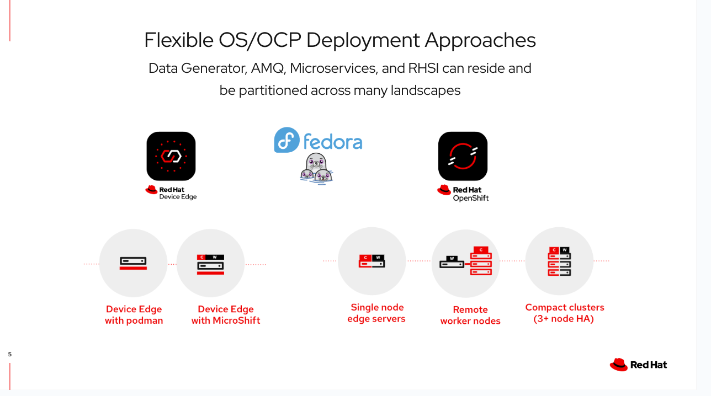

# IoT, Sensor Data, Microshift, Application Services, and Skupper
### Flexible Adaptable Edge:  Art of The Possible




## Overview
This rough demo simulates oil pumping "pumpjack(s)" out in an oil field sending random data to a local/field based edge device for immediate analysis. Then the edge server calls a "legacy" enterprise application service at a data center for further analysis.    

The use of a pumpjack as the IoT example endpoint could easily be swapped out in favor of other use cases such as manufacturing equipment in an assembly line, Bank ATM's, drones, handheld devices, etc.    

*This demo itself is not very complex, and more could be added easily, but there is complexity in installing, configuring, and alinging all the pieces correctly.  As mentioned elsewhere, Ansible would be a great addition to this type of distributed Edge demo.*

### Demo Flow
- Each Far Edge pumpjack IoT "device" is implemented as a python app (simulators), which generates and sends batches of random values for a few telemetry/sensor data types to an edge microshift device/server via MQTT protocol.  
- The microshift instance has AMQ Broker and a Camel Quarkus app (edge-processor) installed. 
- The edge-processor listens for new data being added to the broker queue, and then transforms each dataset
- The edge-processor then invokes a remote legacy evaluator ( Quarkus legacy-evaluator) via Skupper -- Red Hat Service Interconnect (RHSI). 
- The legacy-evaluator simply reads the data and responds with basic information about the event.

## Inspiration
This demo was inspired by the awesome demo located at  
https://github.com/joshdreagan/iot-demo/blob/master/README.md  
And also by ideas raised during a recent Red Hat RHSI Hackathon, which is when most of this was built.  

## Requirements
- [Apache Maven 3.x](http://maven.apache.org)
- [Red Hat AMQ Broker 7.x](https://developers.redhat.com/products/amq/overview)
- [Red Hat OpenShift 4.x](https://developers.redhat.com/products/openshift/getting-started)
- [Python 3.x](https://www.python.org/downloads/)
- [Red Hat Build of Quarkus](https://access.redhat.com/products/quarkus)
- [Red Hat build of Microshift 4.1x](https://access.redhat.com/documentation/en-us/red_hat_build_of_microshift/4.14)
- [Red Hat Service Interconnect CLI](https://www.redhat.com/en/technologies/cloud-computing/service-interconnect)

## Preparing: Selected Comments
### MicroShift
- Use the above link in Requirements for the latest MicroShift installation documentation.  Take care to ensure you have configured at least the minimal resources and storage as defined in the documentation.
- NOTE: As part of the install/config directions ensure you also follow the guidance to establish a kube configuration for connection from the development env where you are building the services, and also running the python data simulator scripts.  
For Linux an ideal situation is to be able to open a terminal window and be able to do something like  **export KUBECONFIG=~/.kube/microshift** to create a connection with the microshift instance.
### AMQ Broker
- For installing on Microshift use the following guide.  
https://github.com/openshift/microshift/blob/main/docs/user/howto_amq_broker.md  
Skip the beginning "Create MicroShift Server" section go directly to the "Install AMQ Broker" section.
- suggested project/namespace is **amq-broker**
### Red Hat Service Interconnect CLI
- For the most up to date Skupper documentation on installation and configuration for various scenarios use:  
https://skupper.io/docs/index.html
- You need to install the cli on both the microshift project, and also in the OCP instance where the legacy-evaluator is installed, and create a link between them.  *This is covered below in greater detail.*
### Maven, Python, Quarkus
- Basically you just need to ensure your local development/demo environment has these dev env and runtime frameworks installed.

## Building and Running the Demo
### edge-processor
- Move to the edge-processor directory in your locally cloned copy of the repo
- suggested approach is to build the project using the guidance in [the edge-processor project README](./edge-processor/README.md) and create a container using one of the project [Dockerfiles](./edge-processor/src/main/docker/)
- move the container into a registry such as quay.io
- switch to the terminal with the connection to the microshift instance
- using the example yaml [files](./k8s/) (after adjusting their properties) create a project in the microshift server, and deploy the service.
- For example
```
cd edge-processor
mvn clean package
podman build -f src/main/docker/Dockerfile.jvm -t quay.io/<user account>/iot-processor-edge:1.0.x .
podman push quay.io/<user account>/iot-processor-edge:1.0.x

```
Adjust example yaml files accordingly (versions, image name, and MQTT_URL property) and run from k8s directory under base directory
```
oc apply -f k8s/edge-project.yaml
oc apply -f k8s/deploy-edge-processor.yml -n edge

```
### legacy-evaluator
- Move to the legacy-evaluator directory/project in your locally cloned copy of the repo
- Ensure you have a terminal window with access to the OCP instance where you want to install the legacy-evaluator.
- *NOTE: if instead you are installing it on a non OCP env, such as a RHEL instance, then you would just create the service, roll it up as a container, and use skopeo/podman to download/install/run the service remotely, and use the Skupper podman CLI approach.*
    #### Build the Service
    - create a namespace for the legacy-evaluator service  
    ```oc new-project enterprise-evaluator```
    - carefully check the *application.properties* file and adjust as necessary
    - Either create a container using the [README.md](./legacy-evaluator/README.md) and [dockerfile approach](./legacy-evaluator/src/main/docker/) and deploy it to OCP, similar to edge-processor
    - **Or** more directly just s2i binary
    ```mvn clean package install -Dquarkus.kubernetes.deploy=true```
    - Or use some other approach such as jib,s2i from OCP, etc.
### Setting up RHSI (Skupper) Connection
For the default setup you need to install the Skupper/RHSI CLI on both the microshift project *edge* and also on the remote data center/cloud OCP instance in the project *enterprise-evaluator*.  Then you need to create a link between the two and if the service naming and ports are correct the link should be solid.  
#### Some example snippets for a CLI approach * adjust as necessary *
- On the OCP "data center/legacy" terminal window
```
oc project enterprise-evaluator
skupper init --enable-console --enable-flow-collector --console-auth unsecured
skupper status
```
- Keeping in the same OCP connection, move to the base directory of the cloned repo and create a skupper token and expose the legacy service
```
skupper token create token-exchange/secret.token
skupper expose deployment/legacy-evaluator --port 8082
```
- Shift to the microshift connected terminal window and create the "client" connection and link, using the token you created above.
```
skupper init -n edge
skupper status -n edge
skupper link create token-exchange/secret.token -n edge
```
### Run the Python data simulator, view the logs
- The simulator (data generator) is located in the simulators directory.  It is a highly configurable python app that creates batches of sample data, which it then sends in groups to the AMQ Broker on microshift.
- If all of the previous setup went smoothly, then you just need to adjust the bash script [run-sim.sh](./simulators/run-sim.sh) and run it.  Or look at the script and create your own approach for running the python app.  
*NOTE: run-sim.sh calls the python app sim.py*
- The python app *simulators/iot/pumpjack/sim.py* will print to console the data it is creating and sending to the broker.
- You can look at the log files for the edge-processor and legacy-evaluator to see if the data is being read/transformed and passed through the RHSI connection, to and fro.

## Another Demo Approach
Another approach to demoing this is to start with all the pieces running locally on a demo workstation/laptop, then start moving pieces out to microshift, out to a RHEL instance, to the Cloud, and "enterprise" OCP instances.  This shows how RHSI at layer 7 allows developers to rapidly try out different topologies, and also develop pieces locally and test across different topologies. 

## Extension Points and Topology Variations

- Now that the foundation is in place there are many ways to add to the demo.

- Build some GUI's

- Add Business Logic: The idea would be add in business logic in both the edge-processor for local high risk issue resolution ie. if the vibration rate is too high shut down the pump, and also to add more complex logic in the remote legacy-evaluator that takes into account algos, combined views across all remote devices, or listen to and layer in information from Kafka topics filled with other events passing through the main data center in order to provide a more robust response to the microshift based local server.    

- Create a more realistic Legacy Service/App: The legacy-evaluator would be better if it was, for example, a "legacy" JEE application, possibly partially "modernized" with micro-profile extensions.  This approach would give more credence to the idea that one is extending the life of a legacy monolith, while also adapting it to use in a micro-services, distributed edge architecture.    

- Topology Variations: There are "endless" ways the topology can be changed and adapted.  Pieces can be shifted across many tiers, and the whole thing can also be run locally via podman on a laptop. Some hint of this is in the podman directory and various simple bash scripts located around the repo. Moving things around also demonstrates how Skupper can run via podman, locally, and on OpenShift (OCP).  

- Run Legacy Service(s) directly on Linux: From a topology standpoint a bigger case for Skupper could be made if the legacy-evaluator was not running in OpenShift, but was instead perhaps running in a vm on Linux. 

- Simplify the install config with Ansible

- The main point is that one can extend, rebuild, and recast the pieces to suit the use case they are trying to best depict.


